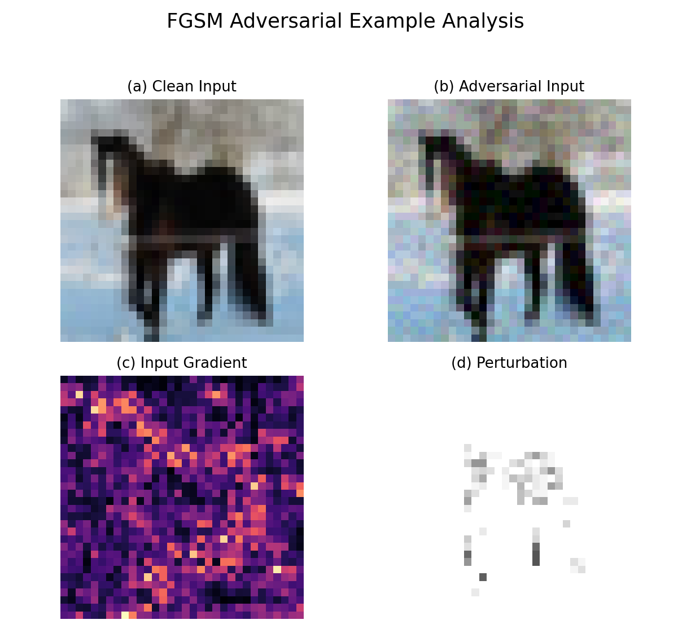

# cnn_adversarial_gradcam_cifar10

A **NumPy-only, from-scratch CompactCNN pipeline for CIFAR-10** with manual
forward/backward propagation, numerical gradient validation, FGSM adversarial
robustness evaluation, and explainability-oriented future work.

This repository is built as an engineering project, not a thin wrapper around
PyTorch or TensorFlow: the CNN layers, gradients, optimizer path, input
gradients, and FGSM attack pipeline are implemented directly with NumPy.

## Project Highlights

| Area | Verified status |
| ---- | --------------- |
| **From-scratch NumPy CNN** | `Conv2D`, `ReLU`, `MaxPool2D`, `Flatten`, `Linear`, and `CompactCNN` implemented manually. |
| **Manual backward propagation** | Layer-level and full-model `backward(...)` pipeline implemented and tested. |
| **Numerical gradient verification** | `Linear`, `Conv2D`, `SoftmaxCrossEntropyLoss`, and input-gradient sanity checks validated. |
| **Automated tests** | `173 passed` in the current local full test suite. |
| **Clean CIFAR-10 portfolio baseline** | Deterministic NumPy baseline checkpoint reached `47.07%` validation accuracy and `44.73%` clean test-subset accuracy. |
| **FGSM adversarial attack pipeline** | Input gradients, FGSM perturbations, clipping, and qualitative visualizations implemented. |
| **Robustness evaluation** | Clean/adversarial metrics, epsilon sweep, accuracy drop, attack success rate, JSON output, and plot generation implemented. |
| **Runtime engineering** | Profiling identified `Conv2D.backward` as the bottleneck; a focused NumPy optimization achieved a documented `207.72x` local speedup. |
| **Structured workflow** | Work-package-based development with tests, deliverables, metrics, and result artifacts. |

## Visual Results

### Clean CIFAR-10 portfolio baseline

| Training loss | Train vs validation accuracy | Confusion matrix |
| ------------- | ---------------------------- | ---------------- |
| [](results/baseline/training_loss_curve.png) | [](results/baseline/train_validation_accuracy_curve.png) | [](results/baseline/confusion_matrix.png) |

Deterministic local baseline configuration:

```text
train_samples: 4096
validation_samples: 1024
test_samples: 1024
batch_size: 32
epochs: 15
learning_rate: 0.03
seed: 42
```

Selected by validation accuracy:

```text
best_epoch: 15
validation_accuracy: 0.4707
clean_test_subset_accuracy: 0.4473
```

Baseline artifacts:

- [Best baseline checkpoint](results/baseline/portfolio_baseline_best.npz)
- [Training history JSON](results/baseline/portfolio_training_history.json)
- [Final metrics JSON](results/baseline/portfolio_final_metrics.json)

### FGSM robustness smoke evaluation

[](results/WP8/fgsm_accuracy_vs_epsilon.png)

Controlled WP8 smoke run over epsilon values from `0/255` through `16/255`.
The pipeline produces clean accuracy, adversarial accuracy, accuracy drop, and
attack success rate metrics.

Important limitation: this committed WP8 smoke plot was generated with the old
tiny subset checkpoint, which achieved `0.0` clean accuracy on the fixed
32-sample subset. It validates the evaluation pipeline rather than proving
final CIFAR-10 robustness. The stronger portfolio baseline above is prepared
for the next FGSM robustness rerun.

### Qualitative FGSM example artifacts

[](results/WP7/qualitative/fgsm_example_000_combined.png)

This 2x2 figure combines the clean input, FGSM adversarial input, loss
input-gradient map, and perturbation visualization from the WP7 qualitative
pipeline.

Source artifacts:

- [Clean image](results/WP7/qualitative/fgsm_example_000_clean.png)
- [FGSM adversarial image](results/WP7/qualitative/fgsm_example_000_adversarial.png)
- [Input-gradient map](results/WP7/qualitative/fgsm_example_000_input_gradient.png)
- [Perturbation map](results/WP7/qualitative/fgsm_example_000_perturbation.png)

## Why This Project Is Technically Significant

The core learning mechanics are implemented manually:

* `Conv2D`, including stride and padding support.
* `ReLU`, `MaxPool2D`, `Flatten`, and `Linear`.
* `SoftmaxCrossEntropyLoss`.
* `SGD` parameter updates.
* Explicit `grad_input`, `grad_weight`, and `grad_bias` computation.
* Full `CompactCNN.backward(grad_logits)` reverse pass.
* Loss-to-input gradients required for FGSM.

This makes the project useful for demonstrating neural-network internals,
numerical programming, debugging discipline, and robust test-driven ML
software development.

## System Pipeline

```text
CIFAR-10 input
  -> CompactCNN
  -> clean prediction
  -> loss and input-gradient computation
  -> FGSM perturbation
  -> adversarial prediction
  -> robustness metrics
  -> saved figures and JSON artifacts
```

## CompactCNN Architecture

The model expects CIFAR-10 tensors in NCHW format:

```text
Input: (N, 3, 32, 32)
```

Architecture implemented in `src/models/compact_cnn.py`:

```text
Input
-> Conv2D(3 -> 8, kernel_size=3, padding=1)
-> ReLU
-> MaxPool2D(kernel_size=2, stride=2)
-> Conv2D(8 -> 16, kernel_size=3, padding=1)
-> ReLU
-> MaxPool2D(kernel_size=2, stride=2)
-> Flatten
-> Linear(16 * 8 * 8 -> 10)
-> logits
```

The output shape is:

```text
(N, 10)
```

## Validation and Testing

Latest local validation:

```text
173 passed
```

The tests cover:

* layer-level forward behavior,
* manual backward propagation,
* gradient shapes and finite values,
* centered finite-difference numerical gradient checks,
* full model backward integration,
* optimizer and training utilities,
* checkpoint save/load,
* JSON metrics persistence,
* plotting helpers,
* input-gradient computation,
* FGSM behavior,
* robustness evaluation and epsilon sweeps,
* experiment runner smoke tests.

Run the full suite:

```bash
.venv/bin/python -m pytest tests/ -q
```

For a fresh environment:

```bash
python -m venv .venv
.venv/bin/python -m pip install -r requirements.txt
.venv/bin/python -m pytest tests/ -q
```

## Numerical Gradient Checking

Manual backpropagation is validated against numerical finite differences.
The repository includes checks for:

* `Linear` input, weight, and bias gradients,
* `Conv2D` input, weight, and bias gradients,
* `SoftmaxCrossEntropyLoss.backward()` with respect to logits,
* `CompactCNN` loss-to-input gradient sanity.

This is important because analytical gradients are implemented manually rather
than delegated to an autodiff framework.

## Runtime Profiling and Optimization

WP6 followed a focused performance-engineering workflow:

1. profile the existing NumPy pipeline,
2. identify one measured bottleneck,
3. optimize only that bottleneck,
4. rerun correctness tests and local benchmarks.

`Conv2D.backward` was selected as the bottleneck. The optimization remained
local to that method and uses `np.einsum`-based accumulation while preserving
the public API, forward behavior, stride, padding, and gradient shapes.

[](results/WP6/conv2d_backward_runtime_comparison.png)

The runtime figure summarizes the engineering workflow:
profile → identify `Conv2D.backward` as the bottleneck → optimize → benchmark.

Documented local benchmark:

| Operation | Before (s) | After (s) | Comparison |
| --------- | ---------: | --------: | ---------: |
| `Conv2D.forward` | `0.000068569` | `0.000066375` | `1.03x` |
| `Conv2D.backward` | `0.043458736` | `0.000209222` | `207.72x` |
| `train_step` | `0.070350708` | `0.001886028` | `37.30x` |

These are controlled local measurements on synthetic data, not broad hardware
benchmarks.

## FGSM Robustness Pipeline

The implemented FGSM pipeline:

1. computes clean logits and predictions,
2. computes loss gradients with respect to input images,
3. generates adversarial examples using:

   ```python
   np.clip(images + epsilon * np.sign(grad_input), 0.0, 1.0)
   ```

4. evaluates adversarial predictions,
5. aggregates clean accuracy, adversarial accuracy, accuracy drop, and attack
   success rate,
6. runs epsilon sweeps,
7. saves metrics and plots.

The controlled WP8 run used:

```text
eval_samples: 32
batch_size: 8
seed: 42
epsilon_values: [0/255, 1/255, 2/255, ..., 16/255]
```

### Experiment artifacts

- [FGSM robustness metrics (JSON)](results/WP8/fgsm_robustness_metrics.json)
- [FGSM accuracy vs. epsilon plot (PNG)](results/WP8/fgsm_accuracy_vs_epsilon.png)
- [WP8 controlled smoke review](deliverables/WP8/wp8_smoke_review.md)

Current result caveat: all clean and adversarial accuracies are `0.0` on the
fixed 32-sample subset because the checkpoint is weak. Treat WP8 as controlled
pipeline validation, not as a final scientific robustness conclusion.

## Reproducibility / How to Run

### Install dependencies

```bash
python -m venv .venv
.venv/bin/python -m pip install -r requirements.txt
```

### Run tests

```bash
.venv/bin/python -m pytest tests/ -q
```

### Run the synthetic baseline smoke test

This does not load CIFAR-10:

```bash
.venv/bin/python -c 'from experiments.baseline.train_baseline import run_synthetic_baseline; result = run_synthetic_baseline(); print(result["final_metrics"])'
```

### Train the portfolio CIFAR-10 baseline

Requires existing local CIFAR-10 data:

```bash
MPLCONFIGDIR=/tmp/cnn-baseline-matplotlib .venv/bin/python -m experiments.baseline.train_portfolio_baseline
```

Default outputs:

- [Best baseline checkpoint](results/baseline/portfolio_baseline_best.npz)
- [Training history JSON](results/baseline/portfolio_training_history.json)
- [Final metrics JSON](results/baseline/portfolio_final_metrics.json)
- [Training loss curve](results/baseline/training_loss_curve.png)
- [Train vs validation accuracy curve](results/baseline/train_validation_accuracy_curve.png)
- [Confusion matrix](results/baseline/confusion_matrix.png)

### Generate qualitative FGSM examples

Requires an existing local checkpoint and extracted CIFAR-10 test batch:

```bash
MPLCONFIGDIR=/tmp/cnn-wp7-matplotlib .venv/bin/python -m experiments.fgsm.generate_examples
```

Default outputs:

- [Clean image](results/WP7/qualitative/fgsm_example_000_clean.png)
- [FGSM adversarial image](results/WP7/qualitative/fgsm_example_000_adversarial.png)
- [Input-gradient map](results/WP7/qualitative/fgsm_example_000_input_gradient.png)
- [Perturbation map](results/WP7/qualitative/fgsm_example_000_perturbation.png)

### Run controlled FGSM robustness evaluation

Requires an existing local checkpoint and extracted CIFAR-10 data:

```bash
MPLCONFIGDIR=/tmp/cnn-wp8-matplotlib .venv/bin/python -m experiments.fgsm.evaluate_robustness
```

Default outputs:

- [FGSM robustness metrics (JSON)](results/WP8/fgsm_robustness_metrics.json)
- [FGSM accuracy vs. epsilon plot (PNG)](results/WP8/fgsm_accuracy_vs_epsilon.png)

The data loader checks for local CIFAR-10 data and does not silently fabricate
large-scale benchmark results.

## Repository Structure

```text
configs/       Project paths, image shape constants, baseline config
src/           NumPy model, layers, losses, optimizer, attacks, metrics
tests/         Unit, integration, numerical-gradient, and runner tests
experiments/   Baseline, runtime profiling, and FGSM experiment entry points
results/       Committed figures and controlled smoke-result artifacts
deliverables/  Work-package summaries, audits, and manual review notes
```

## Engineering Workflow

The project was developed incrementally through work packages. The workflow
emphasized:

* small validated implementation steps,
* deterministic tests,
* manual review notes for forward and backward computations,
* numerical gradient verification,
* profiling before optimization,
* reproducible metrics and figures,
* explicit scope boundaries between completed work and planned work.

## Current Status and Next Steps

### Completed

* CIFAR-10 data pipeline.
* From-scratch CompactCNN forward pass.
* Manual layer and model backward propagation.
* Softmax Cross-Entropy forward/backward.
* Numerical gradient checks.
* Training, evaluation, checkpointing, metrics, and plotting utilities.
* Controlled baseline runners.
* Portfolio clean CIFAR-10 baseline checkpoint and Day 1 training figures.
* Runtime bottleneck profiling and `Conv2D.backward` optimization.
* Input-gradient computation.
* FGSM attack and qualitative visualizations.
* Controlled FGSM robustness evaluation with epsilon sweep.

### Planned

* Rerun FGSM robustness evaluation with the stronger portfolio baseline.
* Grad-CAM implementation and clean/adversarial heatmap comparison.
* PGD and additional attack evaluation if time and runtime allow.
* Optional adversarial training.
* CI and final reproducibility packaging.

Grad-CAM, PGD, black-box attacks, and adversarial training are planned work;
they are not implemented in the current repository state.

## Scope and Limitations

* The core model and learning mechanics are NumPy-based; plotting uses
  Matplotlib and tests use Pytest.
* Current CIFAR-10 experiments are controlled subset or smoke validations.
* The committed WP8 robustness result demonstrates pipeline execution, not a
  strong model-robustness conclusion.
* Full CIFAR-10 multi-epoch training and larger robustness evaluation remain
  future work.
