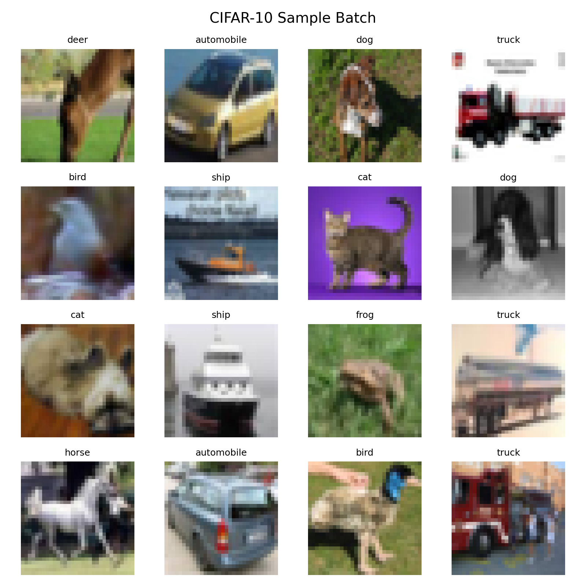

# WP1: Project Setup and CIFAR-10 Data Pipeline

## 1. Objective

The objective of WP1 is to establish a reproducible project foundation and implement a working CIFAR-10 data pipeline for the subsequent from-scratch CNN implementation.

This work package provides the data interface required by later stages of the project, including baseline CNN training, adversarial attacks and Grad-CAM visualization.

## 2. Implemented Components

The following components were implemented in WP1:

* A dedicated Python virtual environment for dependency isolation.
* A configuration module containing the project paths, default batch size and random seed.
* Automatic download and extraction of the CIFAR-10 Python dataset.
* Manual loading of the CIFAR-10 batch files using Python and NumPy.
* Conversion of the image data to the `NCHW` format.
* Conversion of pixel values from integer values in `[0,255]` to `float32` values in `[0,1]`.
* A mini-batch iterator with optional shuffling and reproducible random ordering.
* A pipeline sanity-check script for shape, range and reproducibility verification.
* A visualization routine for generating a CIFAR-10 sample batch figure.
* Automated tests for the data pipeline.

## 3. Data Convention

The following data convention is fixed for the subsequent project stages:

| Item                | Setting                 |
| ------------------- | ----------------------- |
| Dataset             | CIFAR-10 Python version |
| Number of classes   | 10                      |
| Training set size   | 50,000 images           |
| Test set size       | 10,000 images           |
| Image format        | `NCHW`                  |
| Single image shape  | `(3, 32, 32)`           |
| Data type           | `float32`               |
| Pixel value range   | `[0,1]`                 |
| Label range         | `0–9`                   |
| Default batch size  | `64`                    |
| Default random seed | `42`                    |

The use of pixel values in `[0,1]` is important for the later adversarial attack experiments, since the perturbation magnitude `epsilon` will be defined in the same pixel space.

## 4. Verified Results

The implemented CIFAR-10 loader produced the following verified results:

| Item                  | Result                                                               |
| --------------------- | -------------------------------------------------------------------- |
| Dataset               | CIFAR-10 Python version                                                              |
| Training image shape  | `(50000, 3, 32, 32)`                                                                    |
| Training label shape  | `(50000,)`                                                                    |
| Test image shape      | `(10000, 3, 32, 32)`                                                                    |
| Test label shape      | `(10000,)`                                                                    |
| Image format          | `NCHW`                                                               |
| Image data type       | `float32`                                                            |
| Pixel value range     | `[0.0, 1.0]`                                                                    |
| Label range           | `0–9`                                                                |
| Class names           | airplane, automobile, bird, cat, deer, dog, frog, horse, ship, truck |
| Batch size            | `64`                                                                 |
| Random seed           | `42`                                                                 |
| Reproducibility check | Passed                                                               |
| Visual inspection     | Sample batch figure generated and checked                            |

## 5. Repository Components Used in WP1

The central WP1 implementation is organized as follows:

```text
configs/
└── default_config.py          Project paths, seed and batch-size settings

src/
├── data/
│   ├── cifar10_loader.py      CIFAR-10 download, extraction and loading
│   └── batching.py            Mini-batch generation
└── utils/
    └── seed.py                Random seed configuration

experiments/
└── check_data_pipeline.py     Complete pipeline sanity check and visualization

tests/
└── test_data_pipeline.py      Automated data pipeline tests

results/
└── figures/
    └── cifar10_sample_batch.png

requirements.txt               Python dependency versions
```

The downloaded CIFAR-10 files are stored locally under `data/raw/`. This folder is excluded from Git version control because the dataset can be downloaded automatically by the loader.

## 6. Visual Verification

The following figure is generated by the pipeline sanity-check script and is used to manually verify that image values, channel order and class labels are displayed correctly:



The generated figure contains sixteen CIFAR-10 images with their corresponding class labels.

## 7. How to Reproduce the WP1 Results

### 7.1 Clone the Repository

Clone the repository and enter the project directory:

```bash
git clone <repository-url>
cd cnn_adversarial_gradcam_cifar10
```

### 7.2 Create and Activate a Virtual Environment

On macOS or Linux:

```bash
python3 -m venv .venv
source .venv/bin/activate
```

On Windows PowerShell:

```powershell
python -m venv .venv
.venv\Scripts\Activate.ps1
```

### 7.3 Install the Dependencies

```bash
python -m pip install --upgrade pip
python -m pip install -r requirements.txt
```

### 7.4 Run the Data Pipeline Sanity Check

```bash
python -m experiments.check_data_pipeline
```

On the first execution, the CIFAR-10 dataset is automatically downloaded and extracted into the local `data/raw/` directory.

The expected output includes:

```text
Training images shape: (50000, 3, 32, 32)
Training labels shape: (50000,)
Test images shape: (10000, 3, 32, 32)
Test labels shape: (10000,)
Image dtype: float32
Image value range: [0.000, 1.000]
Label range: [0, 9]
Mini-batch shape: (64, 3, 32, 32)
Reproducibility check passed: identical seed produces identical first batch.
All WP1 data pipeline checks passed successfully.
```

The script also generates:

```text
results/figures/cifar10_sample_batch.png
```

### 7.5 Run the Automated Tests

```bash
python -m pytest tests/test_data_pipeline.py -v
```

The expected test results are:

```text
test_cifar10_shapes_and_ranges PASSED
test_minibatch_shapes PASSED
test_minibatch_reproducibility PASSED
```

## 8. Reproducibility Notes

The current pipeline uses a default random seed of `42`. When the same seed and batch size are used, the first shuffled mini-batch is reproduced identically.

The dataset is not committed to the repository. Instead, the loader downloads and extracts it automatically when it is first required. This keeps the repository lightweight while ensuring that all group members can reproduce the same data-processing workflow.

## 9. WP1 Completion Status

WP1 is considered complete once the following conditions are satisfied:

* The project environment can be recreated from `requirements.txt`.
* CIFAR-10 is downloaded and loaded successfully.
* Training and test data shapes are verified.
* Images use the `NCHW` format and the `[0,1]` pixel-value convention.
* Mini-batches can be generated successfully.
* The reproducibility check passes under the fixed random seed.
* A sample batch figure is generated and manually inspected.
* All automated data-pipeline tests pass.

## 10. Next Step

The next work package is WP2: implementation of the compact CNN forward pass from scratch.

The fixed WP1 data interface will be used as the model input convention:

```text
Input batch shape: (batch_size, 3, 32, 32)
Input data type: float32
Input value range: [0,1]
```
